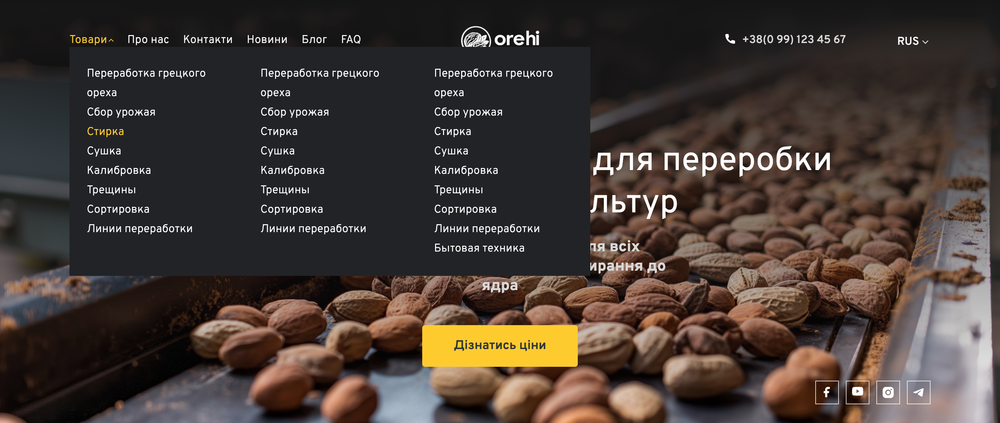
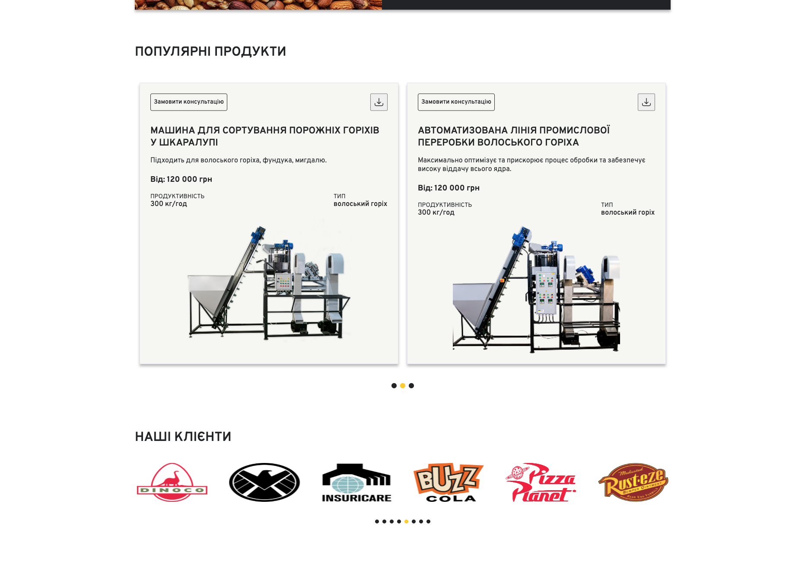
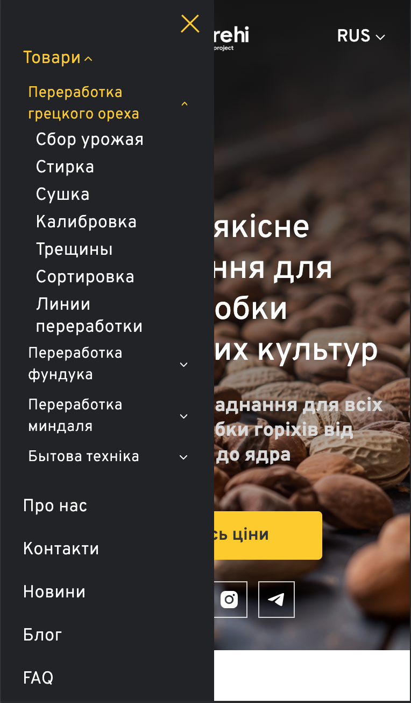
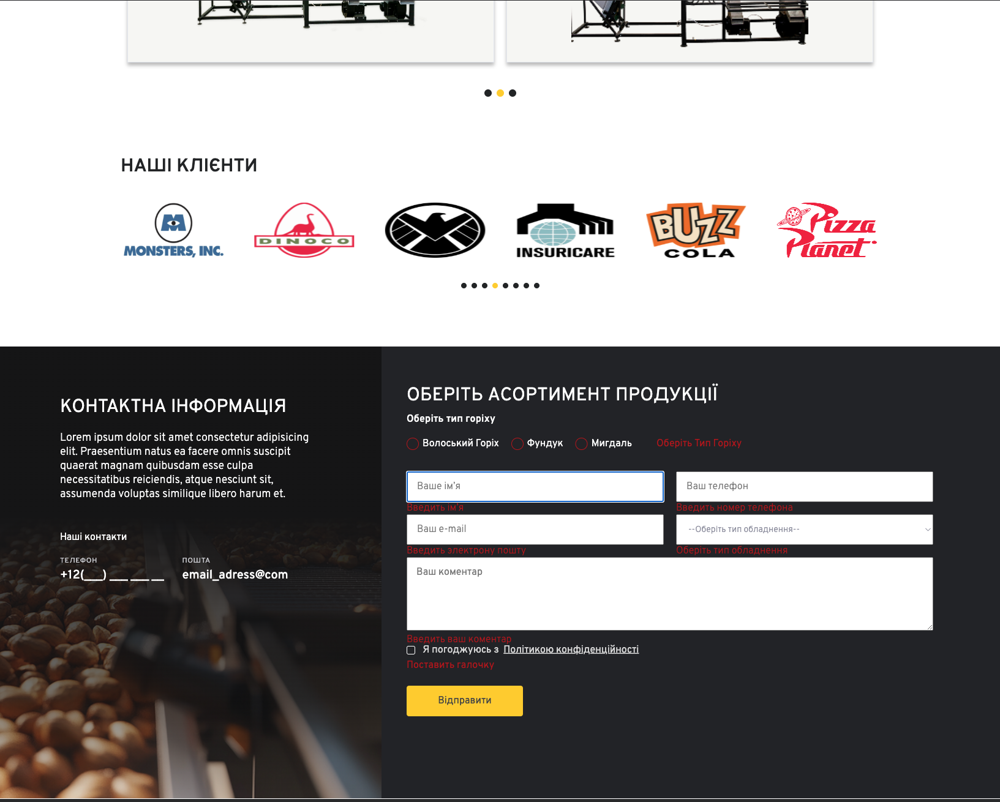
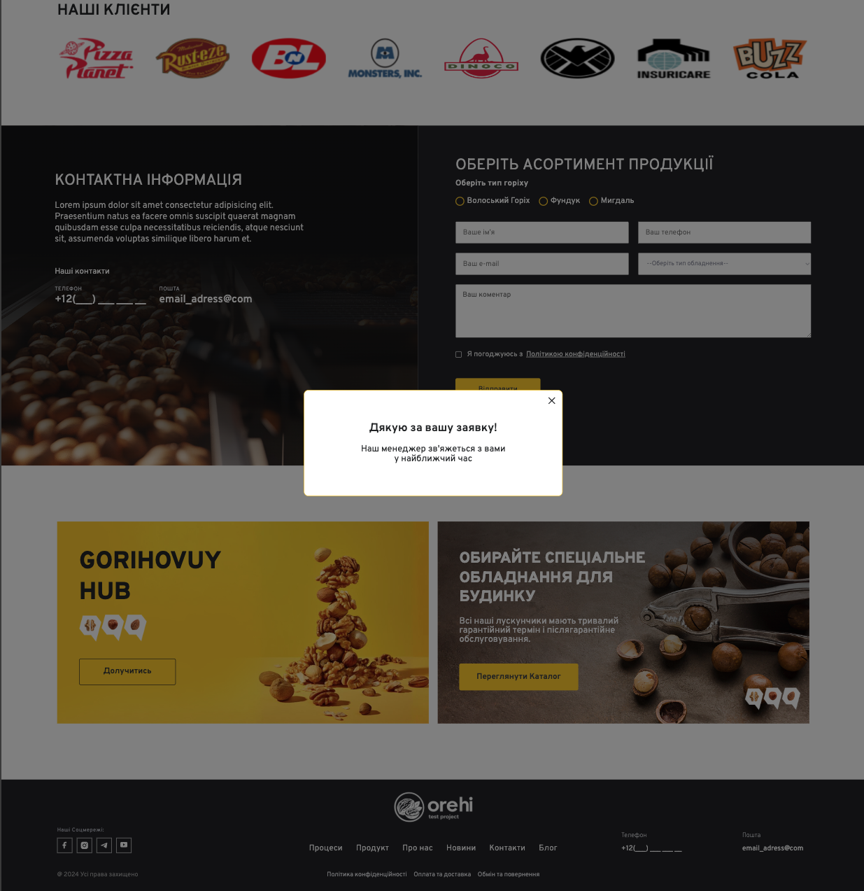

# Oreh — Nut Equipment Landing Page

> Responsive frontend landing page for a fictional nut-processing equipment brand.

[Live Demo](https://oreh-test-project.vercel.app) · [Source Code](https://github.com/Maksim-9999/Oreh-test-project)

## About the project

**Oreh** is an educational frontend project that demonstrates a commercial, content-rich landing page. The project focuses on responsive layout, interactive UI components, client-side validation, and a serverless form endpoint deployed with Vercel.

The goal was to turn a complex business-oriented design into a clean, maintainable frontend implementation without using a frontend framework.

> This is a non-commercial demo created for educational and portfolio purposes. It is not affiliated with any real company, brand, or website. Content and visual materials are used only to demonstrate frontend skills.

## Features

- Responsive layout for desktop, tablet, and mobile devices
- Multi-level mobile navigation with expandable categories
- Product and client carousels powered by Swiper
- Contact form with client-side validation
- Serverless form endpoint through Vercel Functions
- Success and error popup feedback after form submission
- Closing popups with a button, backdrop click, or `Escape`
- Modular JavaScript architecture
- Sass styles organized by blocks and reusable UI elements
- Production build with Vite

## Screenshots

| Hero section (desktop)                                | Dropdown navigation (desktop)                                                |
| ----------------------------------------------------- | ---------------------------------------------------------------------------- |
|  |  |

| Product carousel & clients                                     | Mobile navigation                                   |
| -------------------------------------------------------------- | --------------------------------------------------- |
|  |  |

| Form validation                                             | Success feedback                                       |
| ----------------------------------------------------------- | ------------------------------------------------------ |
|  |  |

## Tech stack

- HTML5
- SCSS / Sass
- JavaScript (ES6+)
- Vite
- Swiper
- JustValidate
- Vercel Functions
- Git and GitHub

## Project structure

```text
api/
└── submit.js             # Vercel serverless form endpoint

src/
├── fonts/                # Local font files
├── img/                  # Images and SVG assets
├── js/
│   ├── modules/
│   │   ├── burger-menu.js
│   │   ├── popup.js
│   │   ├── slider.js
│   │   └── validator.js
│   └── script.js         # Application entry point
└── sass/
    ├── base/              # Variables, mixins, base styles
    ├── blocks/            # Page sections and components
    ├── libs/               # Fonts and third-party reset styles
    ├── ui/                 # Reusable UI elements
    └── style.scss          # Main stylesheet entry point
```

## Local development

```bash
git clone https://github.com/Maksim-9999/Oreh-test-project.git
cd Oreh-test-project
npm install
npm run dev
```

### Testing the contact form locally

To run the frontend together with the Vercel serverless API:

```bash
npm run dev:vercel
```

### Available commands

| Command              | Description                                 |
| -------------------- | ------------------------------------------- |
| `npm run dev`        | Start the Vite development server           |
| `npm run dev:vercel` | Start the project with the local Vercel API |
| `npm run build`      | Create a production build                   |
| `npm run preview`    | Preview the production build locally        |

## Contact form

The form validates user input in the browser and sends valid submissions to:

```
POST /api/submit
```

The endpoint validates required fields and returns a success response. The demo does not store, email, or otherwise process personal data.

## Deployment

The project is prepared for deployment on Vercel:

1. Import the repository in Vercel.
2. Vercel detects Vite automatically.
3. Use the default build command:
   ```bash
   npm run build
   ```
4. Vercel publishes the static site and the `/api/submit` serverless function.

## What I practised

- Structuring a medium-sized frontend project
- Building responsive layouts from a design reference
- Working with Sass modules and reusable styles
- Implementing interactive menus without a framework
- Integrating third-party JavaScript libraries
- Validating user input on the client side
- Building a serverless API endpoint for a contact form
- Preparing a project for production deployment

## Future improvements

- Connect form submissions to email or Telegram notifications
- Replace demo links and contact information with functional pages
- Add automated tests and linting
- Optimize large image assets and add lazy loading

## Author

**Maksim Duljuk**
GitHub: [@Maksim-9999](https://github.com/Maksim-9999)
LinkedIn: [Maksim Duljuk](https://www.linkedin.com/in/maksim-duljuk-1b0071423/)
